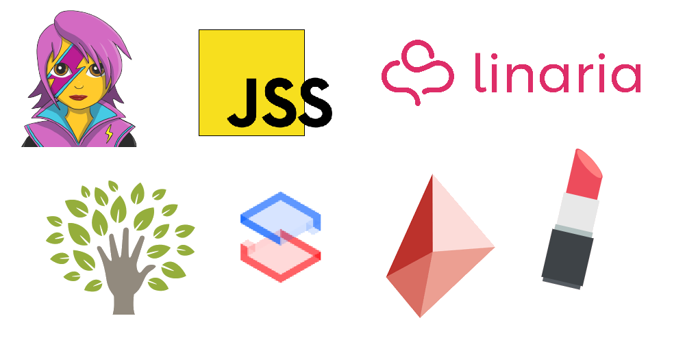
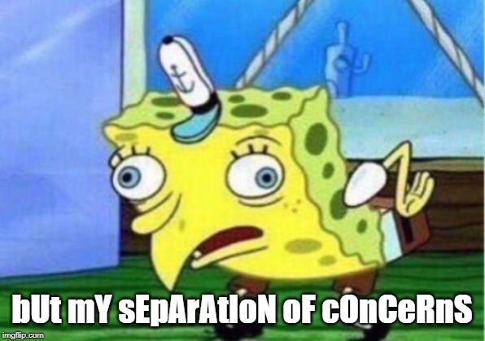

export { future as theme } from 'mdx-deck/themes';
import { Appear } from 'mdx-deck';
import { CodeSurfer } from 'mdx-deck-code-surfer';
import nightOwl from 'prism-react-renderer/themes/nightOwl';

## Stay Suave with `styled-components`

 
 
 
 

#### Gareth Kloeden

##### September 11, 2019

---

## CSS-in-JS

<Appear>
  
Write your styles in your JavaScript

  
Tightly couple components with their styles

  
Do cool stuff with the full power of JavaScript

  
A heck of a lot better now than it used to be

  
Concept introduced in 2014 by Vjeux (Facebook engineer)

</Appear>

---

## Many CSS-in-JS Libraries

<Appear>
  
Emotion, JSS, Linaria, Aphrodite, Styletron, Radium, Glamorous...

</Appear>

---

## Historical Concerns

<Appear>
  
Weird JavaScript object camelCase syntax

  
Inline styles?

  
Prevents you from actually learning CSS

  
Hard to debug - no real class names

</Appear>

---

<Appear>
  
(you're already writing JSX)

  
(think in components)

  
(alleviate the need for BEM, OOCSS, the like)

</Appear>

---

## Really, Why Use CSS-in-JS?

---

## What is `styled-components`

<Appear>
  
Directly style React components and HTML elements

  <h3>Why use over other CSS-in-JS libraries?</h3>
  
Great API - write actual CSS

  
Under active development - always improving

  
Extremely flexible, incrementally adoptable

</Appear>

---

<CodeSurfer
  code={require('!raw-loader!./components/Example.js')}
  lang="javascript"
  showNumbers={true}
  theme={nightOwl}
  steps={[
    { range: [1, 22] },
    { lines: [2] },
    { range: [4, 12] },
    { lines: [16, 18] },
    { lines: [17] },
    { range: [1, 22] },
  ]}
/>

---

import Example from './components/Example';

<Example />

---

## Tagged Template Literals

<Appear>
  
An ES6 feature ``

  
Are actually functions!

  

    <code>styled.button``</code> is like <code>styled.button()</code> (but not identical!)
  

  

    Can run <strong>interpolations</strong> - e.g. variables, functions
  

</Appear>

---

<CodeSurfer code={require('!raw-loader!./components/ttl.js')} lang="javascript" showNumbers={true} theme={nightOwl} />

---

<CodeSurfer
  code={require('!raw-loader!./components/ttlCool.js')}
  lang="javascript"
  showNumbers={true}
  theme={nightOwl}
  steps={[{ range: [1, 8] }, { notes: 'Just believe that this lets you do cool stuff' }]}
/>

---

## Learn More!

### Search "how does styled-components work"

---

## Get Sassy

<Appear>
  
Supports full Sass-style nesting

  

    <strong>Not every element has to be a styled component</strong>
  

  
You can still use classes

</Appear>

---

<CodeSurfer
  code={require('!raw-loader!./components/ExampleTwo.js')}
  lang="javascript"
  showNumbers={true}
  theme={nightOwl}
  steps={[
    { range: [1, 40] },
    { range: [4, 17] },
    { range: [11, 17] },
    { range: [25, 28] },
    { range: [32, 36] },
    { range: [19, 22] },
  ]}
/>

---

import ExampleTwo from './components/ExampleTwo';

<ExampleTwo />

---

## Extending Components

<Appear>
  
Build styled components from other components

  

    <code>const Extended = styled(Base)``</code>
  

  
Both other styled components and other React components...

  
...IF the React component passes the className prop

  
Works with some third-party components too (if they do above)

</Appear>

---

<CodeSurfer
  code={require('!raw-loader!./components/Extending.js')}
  lang="javascript"
  showNumbers={true}
  theme={nightOwl}
  steps={[{ range: [1, 30] }, { range: [4, 9] }, { range: [11, 17] }, { range: [21, 26] }]}
/>

---

import Extending from './components/Extending';

<Extending />

---

## Props, Props, Props

<Appear>
  
Vary CSS properties based on props

  
Dynamic styles without manually modifying classes

  

    <code>$&#123;props => props.theProp&#125;</code>
  

</Appear>

---

<CodeSurfer
  code={require('!raw-loader!./components/Classes.js')}
  lang="javascript"
  showNumbers={true}
  theme={nightOwl}
  steps={[
    { range: [1, 47] },
    { range: [4, 18] },
    { range: [11, 17] },
    { range: [28, 45] },
    { range: [29, 30] },
    { range: [34, 36] },
    { range: [38, 40] },
    { range: [20, 26] },
  ]}
/>

---

import Classes from './components/Classes';

<Classes />

---

<CodeSurfer
  code={require('!raw-loader!./components/Props.js')}
  lang="javascript"
  showNumbers={true}
  theme={nightOwl}
  steps={[
    { range: [1, 33] },
    { range: [4, 12] },
    { range: [9, 11] },
    { range: [14, 31] },
    { range: [20, 22] },
    { range: [24, 26] },
  ]}
/>

---

import Props from './components/Props';

<Props />

---

import Cool from './components/Cool';

<Cool />

---

<CodeSurfer
  code={require('!raw-loader!./components/Cool.js')}
  lang="javascript"
  showNumbers={true}
  theme={nightOwl}
  steps={[{ range: [1, 46] }, { range: [17, 19] }, { range: [4, 12] }, { range: [28, 43] }, { range: [22, 24] }]}
/>

---

<Cool />

---

## Animations

<Appear>
  
Transforms all work the same

  

    <code>keyframes</code> for using keyframes
  

</Appear>

---

<CodeSurfer
  code={require('!raw-loader!./components/Keyframe.js')}
  lang="javascript"
  showNumbers={true}
  theme={nightOwl}
  steps={[{ range: [1, 38] }, { lines: [2] }, { range: [4, 16] }, { lines: [27] }, { range: [30, 36] }]}
/>

---

import Keyframe from './components/Keyframe';

<Keyframe />

---

## Global Styles

<Appear>
  

    <code>createGlobalStyle</code> to create a global style component
  

  

    (<code>injectGlobal</code> in older versions)
  

</Appear>

---

<CodeSurfer
  code={require('!raw-loader!./components/Global.js')}
  lang="javascript"
  showNumbers={true}
  theme={nightOwl}
  steps={[
    { range: [1, 41] },
    { lines: [2] },
    { range: [4, 16] },
    { range: [25, 27] },
    { range: [30, 39] },
    { lines: [33] },
  ]}
/>

---

import Global from './components/Global';

<Global />

---

## Themes

<Appear>
  

    <code>ThemeProvider</code> component
  

  

    Accepts a prop called <code>theme</code> that's an object
  

  
Anything in the theme provider's tree has access to values in the theme

  

    <code>$&#123;props => props.theme.property&#125;</code>
  

  

    <a href="https://medium.com/@garethbk/functional-styled-components-theme-helpers-d99dd4087596">
      https://medium.com/@garethbk/functional-styled-components-theme-helpers-d99dd4087596
    </a>
  

  
(I prefer custom properties)

</Appear>

---

<CodeSurfer
  code={require('!raw-loader!./components/Theme.js')}
  lang="javascript"
  showNumbers={true}
  theme={nightOwl}
  steps={[{ range: [1, 31] }, { lines: [2] }, { range: [4, 9] }, { range: [14, 16] }, { range: [23, 27] }]}
/>

---

import Theme from './components/Theme';

<Theme />

---

## Other Stuff

<Appear>
  

    Supports server side rendering with <code>ServerStyleSheet</code>
  

  
Works with React Native too!

  

    <code>babel-plugin-styled-components</code> gives you readable class names
  

  
TypeScript supported with community-provided type definitions

</Appear>

---

## `polished`

<Appear>
  
Another package that offers useful helpers

  
lighten, desaturate, rgba, etc. functions

  
Very similar to Sass functions

</Appear>

---

## Drawbacks

<Appear>
  
Performance (maybe?)

  
Some things more annoying than Sass (e.g. themes)

  
No separate stylesheet files

  
Is a new paradigm to adjust to

</Appear>

---

## Thank you

https://stay-suave-with-styled-components.netlify.com

https://github.com/garethpbk/stay-suave-with-styled-components

@garethpbk on github, @garethbk everywhere else

